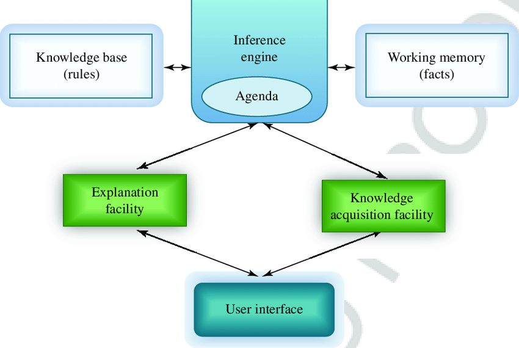

This is a "High-Yield" theory question. You must draw the **Architecture Diagram** to get the full 7 marks. 

---

### **2024 Q6 a) What is an expert system? Explain the architecture of an expert system in detail. (7 Marks)**

#### 📝 High-Yield Exam Note

**1. Definition of Expert System:**
An Expert System is a branch of AI that emulates the decision-making ability of a human expert in a specific field (e.g., medicine, finance, or engineering). It uses a base of knowledge and a set of rules to solve complex problems that normally require human expertise.

**2. Architecture of an Expert System:**
The architecture consists of the following key components:

*   **Knowledge Base (The Memory):** This is the heart of the system. It contains specialized knowledge, facts, and "if-then" rules obtained from human experts.
*   **Inference Engine (The Brain):** This is the processing unit. It applies logical rules to the facts in the knowledge base to reach a conclusion. It uses two methods:
    *   *Forward Chaining* (Data to Goal)
    *   *Backward Chaining* (Goal to Data)
*   **User Interface (The Screen):** This allows the user to interact with the system—asking questions and receiving answers.
*   **Working Memory (Blackboard):** A temporary database that stores the current facts discovered during the conversation with the user.
*   **Explanation Subsystem:** This tells the user **"Why"** or **"How"** the system reached a specific conclusion. 
*   **Knowledge Acquisition Module:** A tool for experts to update the knowledge base without needing a programmer.

*(Exam Tip: Draw a simple box diagram with **User Interface** connecting to the **Inference Engine**, which connects to both the **Working Memory** and the **Knowledge Base**.)*

---

### 🧠 Core Concept Guide (Romanized Nepali + English)

**Concept bujhne tarika (How to remember in 1 minute):**

*   **Expert System vaneko k ho?:** Yeslai "Digital Doctor" ya "Digital Expert" manna sakkiynxa. Manxe ko expertise lai computer vitra "Rules" banayera haldini system ho.
*   **Architecture ko Story:**
    1.  **Knowledge Base (Pustakalaya):** Expert ko sabai knowledge (Facts + Rules) yaha store hunxa.
    2.  **Inference Engine (Dimag):** Yo engine le "Rules" haru use garera result nikalxa. Example: "Yedi khoki lageko xa (fact) + joro aako xa (fact) -> vane ruga lageko ho (rule)."
    3.  **User Interface:** User le query halne thau.
    4.  **Explanation Subsystem:** Yesle "Kina" tyo result aayo vanera logic dinxa. Jastai doctor le "Timro report herda kheri yo dekhyo, tesaile yo vyadhi ho" vaneko jastai.
*   **Exam Hack:** "Specific Domain" (kunai euta field ko matra master hunu) ra "Inference Engine" word underline garne. Diagram ma "Knowledge Base" ra "Inference Engine" ko connectivity ramrari dekhaune. 

---

**Status:** 2024 Q6(a) ✅ Slayed! 

Now let's wrap up 6b and then the short notes (Q7) to finish the 2024 set completely! 

**2024 Q6 b) Examples of ambiguity (Phonetic, Syntactic, Semantic, Pragmatic) in NLP.** 
Ready? Type "NLP" to continue.